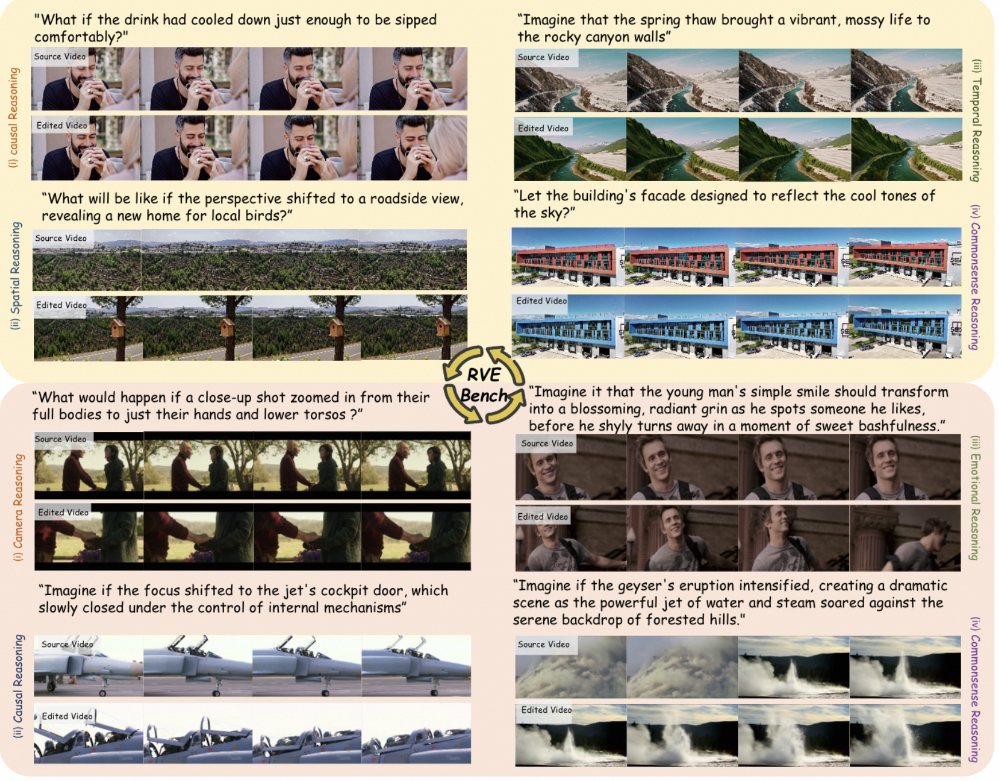
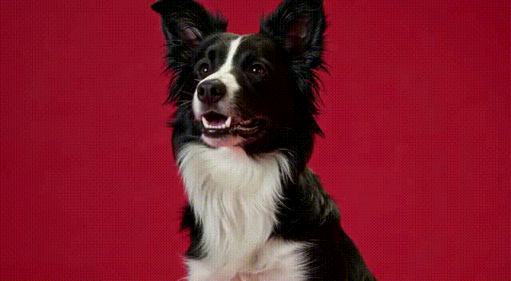
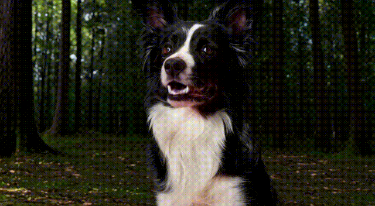
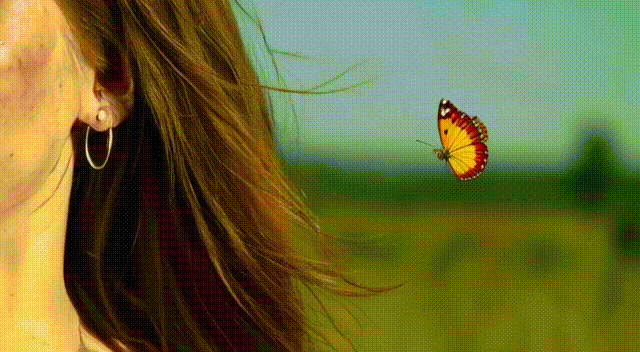

<div align="center">
<h1>ReViSE: Towards Reason-Informed Video Editing in Unified Models with Self-Reflective Learning</h1>
<a href="https://arxiv.org/abs/2512.09924" target="_blank">
  
</a>

Xinyu Liu, Hangjie Yuan*<sup>&#9993;</sup>, Yujie Wei, Jiazheng Xing, Yujin Han, Jiahao Pan, Yanbiao Ma, <br>
Chi-Min Chan, Kang Zhao, Shiwei Zhang, Wenhan Luo<sup>&#9993;</sup>, QiYike Guo

<sup>*</sup>Project Leader
<sup>&#9993;</sup>Corresponding Authors

</div>

> Abstract: Video unified models exhibit strong capabilities in understanding and generation, yet they struggle with reason-informed visual editing even when equipped with powerful internal vision-language models (VLMs). We attribute this gap to two factors: 1) existing datasets are inadequate for training and evaluating reasoning-aware video editing, and 2) an inherent disconnect between the models' reasoning and editing capabilities, which prevents the rich understanding from effectively instructing the editing process. Bridging this gap requires an integrated framework that connects reasoning with visual transformation. To address this gap, we introduce the Reason-Informed Video Editing (RVE) task, which requires reasoning about physical plausibility and causal dynamics during editing. To support systematic evaluation, we construct RVE-Bench, a comprehensive benchmark with two complementary subsets: Reasoning-Informed Video Editing and In-Context Video Generation. These subsets cover diverse reasoning dimensions and real-world editing scenarios. Building upon this foundation, we propose the ReViSE, a Self-Reflective Reasoning (SRF) framework that unifies generation and evaluation within a single architecture. The model’s internal VLM provides intrinsic feedback by assessing whether the edited video logically satisfies the given instruction. The differential feedback that refines the generator’s reasoning behavior during training. Extensive experiments on RVE-Bench demonstrate that ReViSE significantly enhances editing accuracy and visual fidelity, achieving a 32% improvement of Overall score in reasoning-informed video editing subset over state-of-the-art methods.
<details>
<summary>CLICK for the RVE-Bench abstract</summary>



</details>

## 🚧 Todo
- [√] Release pre-trained checkpoints on RVE-Bench
- [√] Release the inference code of our model to facilitate further research and reproducibility.
- [ ] Release the RVE-Bench data
- [ ] Release the training code

## 🚀 Quick Start
1. Create conda environment
```bash
conda create -n revise python=3.10
conda activate revise

pip install -r pip_requirements.txt
```
2. Create conda environment
```bash
# For CUDA (adjust path as needed)
export CUDA_HOME="/usr/local/cuda"
export PATH="${CUDA_HOME}/bin:${PATH}"
export LD_LIBRARY_PATH="${CUDA_HOME}/lib64:${LD_LIBRARY_PATH}"

# Add to inference or training script
export PYTHONPATH="${PWD}:${PWD}/nets/third_party:${PYTHONPATH}"
```
3. Downloading checkpoints
Download our pretrained model checkpoint [here](https://huggingface.co/sophiaa/revise/tree/main/revise_ckpt).

### Inference
```bash
# Run inference with sample data
bash tools/inference/inference.sh
```
<!-- ### Training
```bash
bash finetune_revise.sh
```
For detailed usage instructions, please refer to the [SETUP_MODELS.md](SETUP_MODELS.md). -->

## Demos
### Reason-informed video editing
<div align="center">
<table style="border-collapse: collapse; width: 60%; font-size: 14px;">
  
  <tr>
    <td colspan="2" style="text-align:center; padding:6px;">
      <strong>What if the the dog ran into the depth of a forest?</strong>
    </td>
  </tr>
  <tr>
    <td style="text-align:center; padding:4px;">
      
    </td>
    <td style="text-align:center; padding:4px;">
      
    </td>
  </tr>

  <tr>
    <td colspan="2" style="text-align:center; padding:6px;">
      <strong>What if the scene transitioned from a magical night to a dawn, causing the northern lights to fade away?</strong>
    </td>
  </tr>
  <tr>
    <td style="text-align:center; padding:4px;">
      
    </td>
    <td style="text-align:center; padding:4px;">
      
    </td>
  </tr>

  <tr>
    <td colspan="2" style="text-align:center; padding:6px;">
      <strong>What if the girl’s fragrance gently attracted a delicate butterfly, fluttering toward her?</strong>
    </td>
  </tr>
  <tr>
    <td style="text-align:center; padding:4px;">
      
    </td>
    <td style="text-align:center; padding:4px;">
      
    </td>
  </tr>

</table>
</div>

</div>

## Acknowledgement
We would like to thank [Omni-Video](https://github.com/SAIS-FUXI/Omni-Video), [VILA](https://github.com/NVlabs/VILA) and [Wan2.1](https://github.com/Wan-Video/Wan2.1) for their excellent work. 

## Citation
If you find this project useful, please consider citing:

```
@misc{liu2025revisereasoninformedvideoediting,
      title={ReViSE: Towards Reason-Informed Video Editing in Unified Models with Self-Reflective Learning}, 
      author={Xinyu Liu and Hangjie Yuan and Yujie Wei and Jiazheng Xing and Yujin Han and Jiahao Pan and Yanbiao Ma and Chi-Min Chan and Kang Zhao and Shiwei Zhang and Wenhan Luo and Yike Guo},
      year={2025},
      eprint={2512.09924},
      archivePrefix={arXiv},
      primaryClass={cs.CV},
      url={https://arxiv.org/abs/2512.09924}, 
}
```
